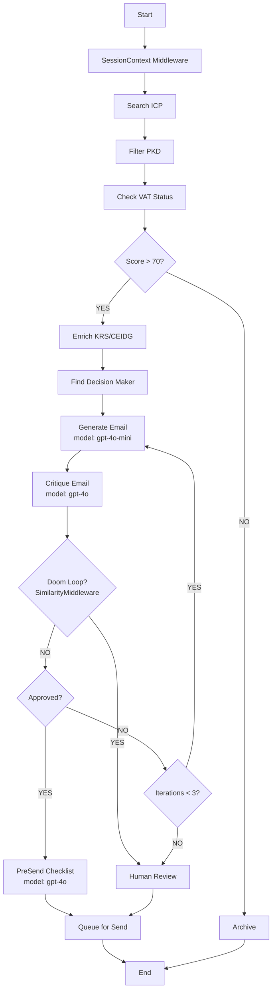
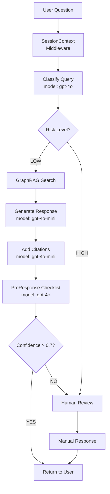
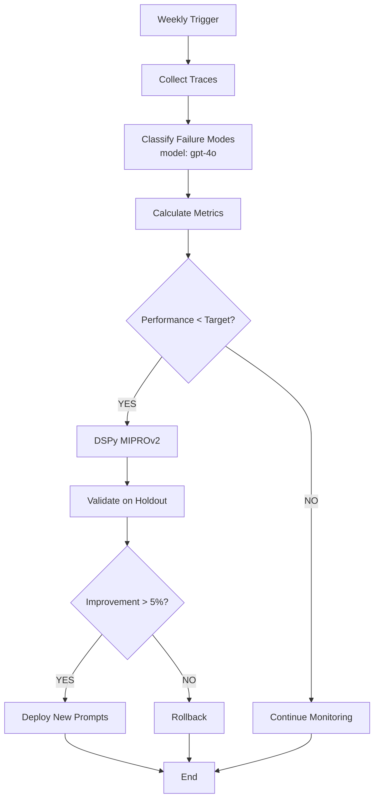

# GapRoll — Agent Blueprints
## LangGraph Architecture for Hunter, Guardian & Analyst

**Last Updated:** 2026-02-18  
**Previous Name:** PayCompass (sunset Feb 14, 2026)  
**Framework:** LangGraph (deterministic orchestration with HITL breakpoints)

---

## 1. Agent System Overview

| Agent | Role | Risk Level | Timeline |
|-------|------|------------|----------|
| **Hunter** | Lead discovery + cold outreach | Medium | Discovery: Mar 29, Outreach: Jun 8 |
| **Guardian** | Legal/HR compliance assistant | HIGH (EU AI Act) | Apr 12 (Alpha), May 17 (Beta) |
| **Analyst** | Self-improvement optimizer | Low | May 10 (Alpha), Jun 8 (Production) |

---

## 1.1 Harness Engineering Principles

> Source: LangChain deep-agents research (Feb 2025). Key insight: **changing only the harness 
> (system prompt, tools, middleware) improved coding agent performance by ~14pp** — no model change needed.
> We apply these principles to our compliance domain.

### Core Philosophy

The purpose of the harness engineer: **prepare and deliver context so agents can autonomously complete work.**

Models are spiky — brilliant at some tasks, blind to others. The harness molds that intelligence for our domain (EU pay transparency compliance). We optimize via:

1. **System Prompt** — domain rules, tone, legal citation requirements
2. **Tools** — GraphRAG, KRS/CEIDG APIs, EVG scoring engine
3. **Middleware** — deterministic checks injected before/after LLM calls

### Five Harness Principles (applied to GapRoll)

| # | Principle | GapRoll Application |
|---|-----------|---------------------|
| 1 | **Self-Verification Loop** | Every agent must Build → Verify → Fix before returning output |
| 2 | **Context Engineering** | Onboard agents with company profile, compliance status, conversation history |
| 3 | **Loop Detection** | Detect doom loops (>90% similarity between iterations) → escalate to HITL |
| 4 | **Reasoning Budget** | Spend more compute on planning & verification, less on generation (GPT-4o/4o-mini routing) |
| 5 | **Trace-Driven Improvement** | Classify failure modes from LangSmith traces → feed into DSPy optimization |

---

## 1.2 Middleware Registry (All Agents)

Middleware = deterministic hooks injected around LLM calls. Not optional — these are the guardrails
that prevent agent failures we've seen in LangChain's research and our own testing.

### PreResponseChecklistMiddleware

**Applies to:** Guardian, Hunter  
**Trigger:** Fires BEFORE agent returns final output to user/queue  
**Purpose:** Forces self-verification (agents naturally skip this step)

```python
class PreResponseChecklistMiddleware:
    """
    Intercepts agent output before delivery.
    Injects a verification prompt forcing the agent to check its own work.
    Similar to LangChain's PreCompletionChecklistMiddleware pattern.
    """
    
    GUARDIAN_CHECKLIST = """
    BEFORE returning this response, verify:
    1. Does every claim have a citation (Art. X Dyrektywy / Kodeks Pracy Art. Y)?
    2. Is confidence score calculated and >0.7? If not, route to HITL.
    3. Does the response answer the EXACT question asked (not a related question)?
    4. Is the tone formal Polish (no anglicisms, no casual language)?
    5. If the answer involves risk (termination, lawsuit, discrimination) — did you flag for HITL?
    6. Is there a concrete recommendation (not just information)?
    
    If ANY check fails, revise before returning. Mark which checks failed.
    """
    
    HUNTER_CHECKLIST = """
    BEFORE queuing this email, verify:
    1. Is there genuine personalization (specific detail about THIS company, not generic)?
    2. Is the deadline mentioned (7 czerwca 2026)?
    3. Is there a clear CTA (Calendly link or specific ask)?
    4. Is the tone formal Polish ("Szanowna Pani/Panie")?
    5. Word count ≤120?
    6. Zero spam trigger words (niesamowity, rewolucyjny, guarantee, exclusive)?
    7. Does the value prop mention concrete benefit (not vague "oszczędność")?
    
    If ANY check fails, revise. Do NOT send to queue until all pass.
    """
    
    def __call__(self, agent_type: str, state: dict) -> dict:
        checklist = self.GUARDIAN_CHECKLIST if agent_type == "guardian" else self.HUNTER_CHECKLIST
        
        # Inject checklist as system message before final output
        verification_prompt = f"""
        You are about to return this response:
        ---
        {state['draft_response']}
        ---
        
        {checklist}
        
        Return VERIFIED response or REVISED response with [REVISION_LOG] appended.
        """
        
        verified = llm.invoke(verification_prompt)
        return {**state, "final_response": verified, "self_verified": True}
```

### SessionContextMiddleware

**Applies to:** Guardian  
**Trigger:** Fires at START of every Guardian session  
**Purpose:** Onboards Guardian with company-specific context (agents perform better with environment awareness)

```python
class SessionContextMiddleware:
    """
    Injects company profile and conversation history at session start.
    LangChain research: 'The more agents know about their environment,
    constraints, and evaluation criteria, the better.'
    """
    
    CONTEXT_TEMPLATE = """
    COMPANY CONTEXT (loaded from database):
    - Firma: {company_name}
    - Branża (PKD): {pkd_code}
    - Wielkość: {employee_count} pracowników
    - Tier: {subscription_tier} (Compliance / Strategia)
    - Status compliance:
      - Raport Art. 16: {art16_status} (złożony / w trakcie / brak)
      - Luka płacowa: {pay_gap_pct}%
      - Ostatnia analiza EVG: {last_evg_date}
      - Otwarte alerty: {open_alerts}
    
    CONVERSATION HISTORY (last 5 questions from this company):
    {recent_questions}
    
    Use this context to provide specific, actionable answers.
    Do NOT ask the user for information that is already available above.
    """
    
    async def __call__(self, state: dict) -> dict:
        org_id = state["organization_id"]
        
        # Fetch from Supabase (RLS ensures data isolation)
        company = await supabase.table("organizations").select("*").eq("id", org_id).single()
        history = await supabase.table("guardian_queries") \
            .select("question, created_at") \
            .eq("organization_id", org_id) \
            .order("created_at", desc=True) \
            .limit(5)
        
        context = self.CONTEXT_TEMPLATE.format(
            company_name=company["name"],
            pkd_code=company["pkd_code"],
            employee_count=company["employee_count"],
            subscription_tier=company["tier"],
            art16_status=company["art16_report_status"],
            pay_gap_pct=company["latest_pay_gap"],
            last_evg_date=company["last_evg_analysis"],
            open_alerts=company["open_alert_count"],
            recent_questions="\n".join([f"- {q['question']} ({q['created_at'][:10]})" for q in history]),
        )
        
        # Prepend to system message
        state["messages"].insert(0, SystemMessage(content=context))
        return state
```

### SimilarityLoopDetectionMiddleware

**Applies to:** Hunter (critic loop), Guardian (revision loop)  
**Trigger:** After each iteration in Generator-Critic cycle  
**Purpose:** Detects doom loops where agent makes cosmetic changes instead of real fixes

```python
from sklearn.metrics.pairwise import cosine_similarity
from sentence_transformers import SentenceTransformer

class SimilarityLoopDetectionMiddleware:
    """
    Tracks edit similarity across iterations.
    If consecutive outputs are >90% similar, the agent is stuck.
    Escalate to HITL instead of burning iterations.
    
    LangChain research: 'Agents can be myopic once they've decided on a plan,
    resulting in doom loops that make small variations to the same broken approach.'
    """
    
    SIMILARITY_THRESHOLD = 0.90  # >90% = doom loop detected
    
    def __init__(self):
        self.encoder = SentenceTransformer("all-MiniLM-L6-v2")  # Fast, lightweight
        self.history: list[str] = []
    
    def __call__(self, state: dict) -> dict:
        current_output = state.get("email_draft") or state.get("draft_response", "")
        
        if self.history:
            prev_embedding = self.encoder.encode([self.history[-1]])
            curr_embedding = self.encoder.encode([current_output])
            similarity = cosine_similarity(prev_embedding, curr_embedding)[0][0]
            
            if similarity > self.SIMILARITY_THRESHOLD:
                state["doom_loop_detected"] = True
                state["loop_similarity"] = float(similarity)
                state["escalation_reason"] = (
                    f"Doom loop detected: {similarity:.1%} similarity between iterations "
                    f"{len(self.history)} and {len(self.history)+1}. "
                    f"Escalating to HITL — agent is making cosmetic changes, not real fixes."
                )
                # Force HITL routing
                return {**state, "approved": False, "force_hitl": True}
            
            # Soft warning at 80%
            if similarity > 0.80:
                state["messages"].append(SystemMessage(
                    content=f"WARNING: Your revision is {similarity:.0%} similar to the previous version. "
                    f"Consider a fundamentally different approach rather than tweaking the same structure."
                ))
        
        self.history.append(current_output)
        return state
```

### ReasoningBudgetMiddleware

**Applies to:** All agents  
**Trigger:** Per-call, routes to appropriate model based on task phase  
**Purpose:** Spend more compute on planning & verification, less on generation ("reasoning sandwich")

```python
class ReasoningBudgetMiddleware:
    """
    Routes LLM calls to appropriate model based on task phase.
    
    LangChain research: 'xhigh-high-xhigh reasoning sandwich' — 
    more compute on planning and verification, less on implementation.
    
    GapRoll adaptation:
    - Planning/Classification → GPT-4o (high reasoning, better accuracy)
    - Generation/Drafting → GPT-4o-mini (fast, cheap, good enough)  
    - Verification/Citation check → GPT-4o (catches mistakes mini misses)
    """
    
    MODEL_ROUTING = {
        # Guardian phases
        "classify_query": "gpt-4o",          # Risk classification = critical
        "graphrag_search": None,              # No LLM needed (deterministic)
        "generate_response": "gpt-4o-mini",   # Draft generation = speed
        "add_citations": "gpt-4o-mini",       # Mechanical task
        "verify_response": "gpt-4o",          # Verification = accuracy
        
        # Hunter phases
        "score_lead": "gpt-4o-mini",          # Simple scoring
        "generate_email": "gpt-4o-mini",      # Draft = speed
        "critique_email": "gpt-4o",           # Critique = accuracy
        "verify_checklist": "gpt-4o",         # Final check = accuracy
        
        # Analyst phases
        "classify_failure": "gpt-4o",         # Analysis = accuracy
        "generate_candidates": "gpt-4o",      # Prompt optimization = quality
        "validate_holdout": "gpt-4o",         # Evaluation = accuracy
    }
    
    def get_model(self, phase: str) -> str:
        return self.MODEL_ROUTING.get(phase, "gpt-4o-mini")  # Default: cheap
    
    def __call__(self, state: dict, phase: str) -> dict:
        model = self.get_model(phase)
        state["current_model"] = model
        state["reasoning_budget_log"] = state.get("reasoning_budget_log", [])
        state["reasoning_budget_log"].append({"phase": phase, "model": model})
        return state
```

---

## 2. Hunter Agent — Cold Outreach Automation

### 2.1 Mission

> Discover Polish companies (50-500 employees) + generate personalized cold emails that don't feel like AI spam.

### 2.2 Architecture (LangGraph)



**Changes vs. v1 (Feb 14):**
- ✅ Added `SessionContext Middleware` at start
- ✅ Added `SimilarityLoopDetection` between Critic and Approve
- ✅ Added `PreSendChecklist` (verification) between Approve and Queue
- ✅ Model annotations on nodes (reasoning budget)

---

### 2.3 LangGraph Implementation

```python
from langgraph.graph import StateGraph, END
from typing import TypedDict, List

class HunterState(TypedDict):
    company_name: str
    pkd_code: str
    vat_number: str
    lead_score: int
    decision_maker: dict
    email_draft: str
    critique: str
    iterations: int
    approved: bool
    # NEW: Harness Engineering fields
    self_verified: bool
    doom_loop_detected: bool
    force_hitl: bool
    loop_similarity: float
    current_model: str
    reasoning_budget_log: list

def search_icp(state: HunterState) -> HunterState:
    """Query KRS/CEIDG for companies matching ICP"""
    # KRS API: target by PKD code (69.20.Z = accounting, 70.22.Z = consulting)
    companies = krs_api.search(pkd_code=["69.20.Z", "70.22.Z"], employees="50-500")
    return {"companies": companies}

def filter_pkd(state: HunterState) -> HunterState:
    """Filter by industry relevance"""
    # Focus: accounting firms, HR consulting, payroll services
    relevant_pkd = ["69.20.Z", "70.22.Z", "82.11.Z"]
    filtered = [c for c in state["companies"] if c["pkd"] in relevant_pkd]
    return {"companies": filtered}

def check_vat(state: HunterState) -> HunterState:
    """Verify VAT registration (active company check)"""
    # Biała Lista Podatników API (Polish VAT registry)
    vat_active = vat_api.verify(state["vat_number"])
    return {"vat_active": vat_active}

def score_lead(state: HunterState) -> HunterState:
    """Calculate lead score (0-100)"""
    score = (
        (state["employees"] / 500) * 30 +  # Size (larger = higher score)
        (state["revenue"] / 10_000_000) * 30 +  # Revenue
        (state["industry_fit"] * 20) +  # Industry relevance
        (state["recency"] * 20)  # Freshly registered = higher intent
    )
    return {"lead_score": score}

def enrich_krs(state: HunterState) -> HunterState:
    """Lazy load: Only enrich if score > 70 (saves API costs)"""
    if state["lead_score"] < 70:
        return state
    
    # KRS API (paid, ~1 PLN/query)
    data = krs_api.get_details(state["company_name"])
    return {
        "size": data["employees"],
        "revenue": data["revenue"],
        "nip": data["nip"],
        "legal_form": data["legal_form"],
    }

def find_decision_maker(state: HunterState) -> HunterState:
    """LinkedIn scraper: Find CEO, CFO, or HR Manager"""
    # Option 1: Cognism API (RODO-compliant)
    # Option 2: LinkedIn Sales Navigator scraper (risky)
    decision_maker = cognism_api.find_contact(
        company=state["company_name"],
        titles=["CEO", "CFO", "HR Manager", "Dyrektor HR"],
    )
    return {"decision_maker": decision_maker}

def generate_email(state: HunterState) -> HunterState:
    """Generate personalized email (GPT-4o-mini — generation phase, speed > accuracy)"""
    state = reasoning_budget.route(state, phase="generate_email")  # Routes to gpt-4o-mini
    
    prompt = f"""
    Napisz polską wiadomość cold outreach dla:
    - Firma: {state['company_name']}
    - Kontakt: {state['decision_maker']['name']} ({state['decision_maker']['title']})
    - Branża: {state['industry']}
    
    ZASADY:
    - Formal tone ("Szanowna Pani" / "Szanowny Panie")
    - Max 120 słów
    - Personalizacja: Wspomnij szczegół o firmie (LinkedIn post, news, job listing)
    - Value prop: "Pełna zgodność z Dyrektywą UE 2023/970 za 99 PLN/mies"
    - CTA: Umów 15-min demo
    - NO spam words: "niesamowity", "rewolucyjny", "exclusive offer"
    """
    
    draft = llm.invoke(prompt, model=state["current_model"])
    return {"email_draft": draft, "iterations": state["iterations"] + 1}

def critique_email(state: HunterState) -> HunterState:
    """Critic LLM: Check for spam triggers (GPT-4o — verification phase, accuracy > speed)"""
    state = reasoning_budget.route(state, phase="critique_email")  # Routes to gpt-4o
    
    prompt = f"""
    Oceń email pod kątem spam triggers:
    
    {state['email_draft']}
    
    Sprawdź:
    - Czy ma słowa spam? (niesamowity, rewolucyjny, guarantee)
    - Czy jest zbyt długi? (max 120 słów)
    - Czy personalizacja jest prawdziwa? (nie generic)
    - Czy CTA jest jasny?
    
    Odpowiedź: "APPROVED" lub "NEEDS_REVISION: [reason]"
    """
    
    critique = llm.invoke(prompt, model=state["current_model"])
    approved = "APPROVED" in critique
    return {"critique": critique, "approved": approved}

def check_similarity_loop(state: HunterState) -> HunterState:
    """Middleware: Detect doom loops before wasting iterations"""
    return similarity_loop_middleware(state)

def pre_send_checklist(state: HunterState) -> HunterState:
    """Final verification before queue (GPT-4o — verification sandwich)"""
    return pre_response_checklist("hunter", state)

def should_continue(state: HunterState) -> str:
    """Router: Continue loop or end?"""
    if state.get("force_hitl"):
        return "hitl"  # Doom loop detected
    elif state["approved"]:
        return "checklist"  # Pre-send verification
    elif state["iterations"] >= 3:
        return "hitl"  # Max iterations reached, human review
    else:
        return "generator"  # Try again

# Build graph
workflow = StateGraph(HunterState)
workflow.add_node("search", search_icp)
workflow.add_node("filter", filter_pkd)
workflow.add_node("vat_check", check_vat)
workflow.add_node("score", score_lead)
workflow.add_node("enrich", enrich_krs)
workflow.add_node("find_dm", find_decision_maker)
workflow.add_node("generator", generate_email)
workflow.add_node("critic", critique_email)
workflow.add_node("loop_check", check_similarity_loop)    # NEW
workflow.add_node("checklist", pre_send_checklist)          # NEW

workflow.add_edge("search", "filter")
workflow.add_edge("filter", "vat_check")
workflow.add_edge("vat_check", "score")
workflow.add_conditional_edges("score", lambda s: "enrich" if s["lead_score"] > 70 else "archive")
workflow.add_edge("enrich", "find_dm")
workflow.add_edge("find_dm", "generator")
workflow.add_edge("generator", "critic")
workflow.add_edge("critic", "loop_check")                   # NEW: critic → loop_check
workflow.add_conditional_edges("loop_check", should_continue)
workflow.add_edge("checklist", "queue")                      # NEW: checklist → queue

workflow.set_entry_point("search")

# Compile with checkpointing (HITL support)
app = workflow.compile(checkpointer=SqliteSaver.from_conn_string("hunter.db"), interrupt_before=["queue"])
```

---

### 2.4 Timeline & Volume Constraints

| Period | Daily Limit | Action | Domain Rep |
|--------|-------------|--------|-----------|
| **Feb 22 - Mar 29** | 0/day | Discovery ONLY (build lead database) | Warming (20/day warm contacts) |
| **Apr 1 - Apr 30** | 20/day | Manual outreach (Bartek approves each email) | 95%+ inbox |
| **May 1 - Jun 7** | 50/day | Semi-automated (Bartek reviews queue, batch approves) | 95%+ inbox |
| **Jun 8+** | 100/day | Fully automated (HITL for edge cases only) | 95%+ inbox |

**Hard Limit:** NEVER exceed 200 emails/day (spam trigger threshold)

---

### 2.5 Email Template (Formal Polish)

```
Temat: Zgodność z Dyrektywą UE 2023/970 — 15 min rozmowa?

Szanowna Pani [Name],

Zauważyłem, że [Company] niedawno [specific detail from LinkedIn/news].

W związku z terminem 7 czerwca 2026 (Dyrektywa UE 2023/970), 
przygotowaliśmy rozwiązanie GapRoll, które automatyzuje raporty Art. 16 w 15 minut.

Czy byłaby Pani zainteresowana 15-minutową rozmową, aby zobaczyć jak to działa?

[Umów demo - Calendly link]

Pozdrawiam,
[Signature]
```

**Key Elements:**
- ✅ Formal greeting ("Szanowna Pani")
- ✅ Personalization (specific detail about company)
- ✅ Urgency (deadline: Jun 7, 2026)
- ✅ Value prop (15 minutes to compliance)
- ✅ Clear CTA (Calendly link)

---

## 3. Guardian Agent — Legal Compliance Assistant

### 3.1 Mission

> Answer Grażyna's legal/HR questions with citations to Art. X of EU Directive 2023/970, Kodeks Pracy, RODO, etc.

### 3.2 Architecture (LangGraph + GraphRAG)



**Changes vs. v1 (Feb 14):**
- ✅ Added `SessionContext Middleware` at start (company profile + conversation history)
- ✅ Added `PreResponse Checklist` verification node before confidence check
- ✅ Split single "RAG → CITE → CONFIDENCE" into 4 nodes with explicit model routing
- ✅ Model annotations (reasoning sandwich: 4o → 4o-mini → 4o-mini → 4o)

---

### 3.3 Risk Classification

| Query Type | Risk Level | Action |
|-----------|------------|--------|
| **Factual (Art. X definition)** | LOW | RAG → Auto-respond |
| **Interpretation (Is gap 12% legal?)** | MEDIUM | RAG + confidence check |
| **Advisory (Should I fire employee X?)** | HIGH | ALWAYS HITL |

**HIGH-RISK Keywords (auto-trigger HITL):**
- "Zwolnienie dyscyplinarne" (disciplinary termination)
- "Wypowiedzenie" (termination)
- "Pozew" (lawsuit)
- "Dyskryminacja" (discrimination)
- "Mobbing" (mobbing)

---

### 3.4 GraphRAG Implementation

**Why GraphRAG (not vector RAG):**
- ✅ Captures relationships: "Art. 16 requires Art. 4" (cross-references)
- ✅ Better for legal docs (hierarchical structure: Directive → Article → Paragraph)
- ❌ Vector RAG: Matches keywords, misses logical connections

**Tech Stack:**
- **Vector DB:** Weaviate (self-hosted on Hetzner VPS)
- **Graph Edges:** Article X → Article Y (requires, references, complements)
- **Embeddings:** text-embedding-3-small (OpenAI, 1536 dims)

**Ingestion Pipeline:**

```python
import weaviate
from langchain.text_splitter import RecursiveCharacterTextSplitter

# Split legal docs into chunks (500 chars, 50 overlap)
splitter = RecursiveCharacterTextSplitter(chunk_size=500, chunk_overlap=50)
chunks = splitter.split_documents([directive_pdf, kodeks_pracy_pdf])

# Create graph edges (manual annotation)
edges = [
    ("Art. 16", "Art. 4", "requires"),  # Art. 16 requires EVG from Art. 4
    ("Art. 7", "Art. 4", "depends_on"),  # Worker reports depend on EVG
    ("Art. 9", "Art. 16", "triggered_by"),  # Joint assessment triggered by gap >5%
]

# Ingest to Weaviate
client = weaviate.Client("http://localhost:8080")
for chunk in chunks:
    client.data_object.create(
        class_name="LegalChunk",
        data_object={
            "text": chunk.page_content,
            "source": chunk.metadata["source"],
            "article": chunk.metadata["article"],
        },
        vector=embed(chunk.page_content),  # OpenAI embedding
    )

# Add edges
for source, target, relation in edges:
    client.data_object.reference.add(
        from_uuid=get_uuid(source),
        to_uuid=get_uuid(target),
        from_property_name=relation,
    )
```

---

### 3.5 Guardian Response Format

**Example Query:**
```
"Czy luka 12% to naruszenie prawa?"
```

**Guardian Response:**
```
Nie automatycznie. Art. 16 Dyrektywy UE 2023/970 nie definiuje "niedopuszczalnego" poziomu luki.

Jednak:
- Jeśli luka >5% → Art. 9 wymaga wyjaśnienia przyczyn (Joint Pay Assessment)
- Jeśli luka >25% → PIP może wszcząć kontrolę (precedens orzecznictwa)

Twoja luka (12%) → wymaga monitorowania i planu działania.

Rekomendacja: Przygotuj Raport Art. 7 (uzasadnienie).

[Link do szablonu Art. 7]

Podstawa prawna:
- Art. 9 Dyrektywy UE 2023/970 (Joint Pay Assessment)
- Art. 16 Dyrektywy UE 2023/970 (Reporting)
```

**Key Elements:**
- ✅ Direct answer ("Nie automatycznie")
- ✅ Legal citations ("Art. 9 wymaga...")
- ✅ Practical guidance ("Przygotuj Raport Art. 7")
- ✅ Polish formal tone

---

## 4. Analyst Agent — Self-Improvement Optimizer

### 4.1 Mission

> Monitor Hunter & Guardian performance → optimize prompts via DSPy MIPROv2 → improve agent quality over time.

### 4.2 Architecture (DSPy + LangSmith)



**Changes vs. v1 (Feb 14):**
- ✅ Added `Classify Failure Modes` node between Collect and Metrics
- ✅ Model annotation (GPT-4o for failure classification — accuracy critical)

---

### 4.3 Failure Mode Taxonomy

> NEW section. LangChain research: automated trace analysis classified failure modes,
> then fed targeted fixes into the harness. We apply the same pattern to our domain.

**Hunter Failure Modes:**

| Code | Failure Mode | Detection Method | Auto-Fix |
|------|-------------|------------------|----------|
| `H-SPAM` | Email flagged as spam | Spam score API + bounce tracking | Revise tone/words |
| `H-GENERIC` | Personalization is fake/generic | Cosine similarity to template >0.85 | Re-enrich from KRS |
| `H-DOOM` | Doom loop (>90% similarity) | SimilarityLoopDetectionMiddleware | Escalate to HITL |
| `H-LONG` | Email >120 words | Word count check | Trim prompt constraint |
| `H-NOTONE` | Wrong tone (informal/English) | Classifier (formal Polish detection) | Re-generate with stricter prompt |
| `H-NOCTA` | Missing or weak CTA | Pattern match for Calendly/demo link | Inject CTA template |

**Guardian Failure Modes:**

| Code | Failure Mode | Detection Method | Auto-Fix |
|------|-------------|------------------|----------|
| `G-NOCITE` | Missing legal citation | Regex for "Art. X" pattern | Re-run with citation prompt |
| `G-WRONGART` | Cites wrong article | Cross-check with GraphRAG edges | Re-query GraphRAG |
| `G-HALLUC` | Hallucinated legal info | Fact-check against Weaviate corpus | Flag for HITL + block |
| `G-TANGENT` | Answers different question | Semantic similarity(question, answer) <0.5 | Re-generate with question echo |
| `G-CASUAL` | Informal tone | Polish formality classifier | Re-generate with tone constraint |
| `G-NOREC` | No recommendation given | Pattern match for "Rekomendacja:" | Append recommendation prompt |
| `G-RISKY` | High-risk query not flagged | Keyword + intent classification | Force HITL routing |

**Analyst Failure Classification Implementation:**

```python
class FailureModeClassifier:
    """
    Analyzes LangSmith traces to classify why an agent output failed.
    Feeds structured failure data into DSPy MIPROv2 for targeted optimization.
    
    Source: LangChain 'Trace Analyzer Skill' pattern — 
    'spawn parallel error analysis agents → synthesize findings → targeted harness changes'
    """
    
    FAILURE_CODES = {
        "hunter": ["H-SPAM", "H-GENERIC", "H-DOOM", "H-LONG", "H-NOTONE", "H-NOCTA"],
        "guardian": ["G-NOCITE", "G-WRONGART", "G-HALLUC", "G-TANGENT", "G-CASUAL", "G-NOREC", "G-RISKY"],
    }
    
    async def classify(self, trace: dict, agent_type: str) -> dict:
        """
        Analyze a single failed trace and return structured failure report.
        Uses GPT-4o for analysis (accuracy > speed for meta-optimization).
        """
        prompt = f"""
        Analyze this agent trace and classify the failure mode.
        
        Agent: {agent_type}
        Input: {trace['input']}
        Output: {trace['output']}
        Expected: {trace.get('expected', 'N/A')}
        HITL Decision: {trace.get('hitl_decision', 'N/A')}
        
        Available failure codes: {self.FAILURE_CODES[agent_type]}
        
        Return JSON:
        {{
            "failure_code": "X-CODE",
            "confidence": 0.0-1.0,
            "root_cause": "Brief explanation",
            "suggested_fix": "Specific harness change (prompt/tool/middleware)"
        }}
        """
        
        result = await llm.ainvoke(prompt, model="gpt-4o")
        return json.loads(result)
    
    async def batch_analyze(self, traces: list[dict], agent_type: str) -> dict:
        """
        Analyze batch of failed traces → aggregate failure patterns.
        Returns prioritized list of harness improvements.
        """
        # Parallel analysis (like LangChain's spawn pattern)
        classifications = await asyncio.gather(*[
            self.classify(trace, agent_type) for trace in traces
        ])
        
        # Aggregate by failure code
        failure_distribution = Counter(c["failure_code"] for c in classifications)
        
        # Prioritize: most frequent failures get fixed first
        return {
            "total_failures": len(traces),
            "distribution": dict(failure_distribution.most_common()),
            "top_3_fixes": [
                c["suggested_fix"] for c in sorted(
                    classifications, key=lambda x: -x["confidence"]
                )[:3]
            ],
            "classifications": classifications,
        }
```

---

### 4.4 Metrics Tracked

**Hunter Agent:**
| Metric | Target | Current | Source |
|--------|--------|---------|--------|
| Email open rate | >20% | 18% | Mailchimp |
| Response rate | >10% | 8% | Mailchimp |
| Spam complaint rate | <0.5% | 0.3% | Mailchimp |
| Bounce rate | <2% | 1.5% | Mailchimp |
| **Doom loop rate** | **<5%** | **TBD** | **SimilarityMiddleware** |
| **Checklist pass rate** | **>90%** | **TBD** | **PreSendChecklist** |

**Guardian Agent:**
| Metric | Target | Current | Source |
|--------|--------|---------|--------|
| Answer accuracy | >90% | 87% | Human eval (Golden Dataset) |
| Citation correctness | 100% | 95% | Automated check |
| HITL rejection rate | <20% | 25% | LangSmith |
| Response time | <5s | 4.2s | LangSmith |
| **Self-verification catch rate** | **>30%** | **TBD** | **PreResponseChecklist** |
| **Context utilization** | **>80%** | **TBD** | **SessionContextMiddleware** |

---

### 4.5 DSPy MIPROv2 Optimization

**What is MIPROv2:**
- Multi-Instruction Prompt Optimization (v2)
- Uses teacher model (GPT-4o) to generate training examples
- Uses student model (GPT-4o-mini) for production (60% cheaper)
- Automatically optimizes prompts based on Golden Dataset
- **NEW: Now receives failure mode classifications as optimization signal**

**Process:**

```python
import dspy
from dspy.teleprompt import MIPROv2

# Define signature
class GuardianQA(dspy.Signature):
    """Answer legal question with citations"""
    question = dspy.InputField(desc="User's legal question")
    answer = dspy.OutputField(desc="Answer with citations to Art. X")

# Create module
class Guardian(dspy.Module):
    def __init__(self):
        super().__init__()
        self.qa = dspy.ChainOfThought(GuardianQA)
    
    def forward(self, question):
        return self.qa(question=question)

# Golden Dataset (50 examples minimum)
trainset = [
    dspy.Example(
        question="Czy luka 12% to naruszenie?",
        answer="Nie automatycznie. Art. 9 wymaga wyjaśnienia jeśli >5%...",
    ).with_inputs("question"),
    # ... 49 more examples
]

# NEW: Enrich trainset with failure mode examples (boosting pattern)
# Focus optimization on areas where agent fails most
failure_report = await failure_classifier.batch_analyze(failed_traces, "guardian")
for classification in failure_report["classifications"]:
    if classification["confidence"] > 0.8:
        trainset.append(dspy.Example(
            question=classification["input"],
            answer=classification["expected"],
            failure_code=classification["failure_code"],  # Extra signal
        ).with_inputs("question"))

# Optimize with MIPROv2
teleprompter = MIPROv2(
    metric=answer_quality_metric,  # Custom metric (citation correctness + accuracy)
    teacher_model=dspy.OpenAI(model="gpt-4o"),
    student_model=dspy.OpenAI(model="gpt-4o-mini"),
    num_candidates=10,  # Generate 10 prompt variations
    max_iterations=5,   # Test up to 5 iterations
)

optimized_guardian = teleprompter.compile(Guardian(), trainset=trainset)
```

**Deployment:**
- Weekly optimization (every Monday 9 AM)
- Validate on holdout set (20% of Golden Dataset)
- Deploy only if improvement >5%
- Rollback if accuracy drops
- **NEW: Failure mode distribution logged per optimization cycle**

---

## 5. HITL (Human-in-the-Loop) Workflow

### 5.1 HITL Queue (Next.js Admin Panel)

**URL:** `/admin/hitl-queue`

**Columns:**
| Column | Content |
|--------|---------|
| **Agent** | Hunter, Guardian, Analyst |
| **Type** | Email draft, Legal Q&A, Prompt change |
| **Created** | Timestamp |
| **Priority** | HIGH (compliance), MEDIUM (outreach), LOW (optimization) |
| **Status** | Pending, Approved, Rejected |
| **Escalation Reason** | NEW: doom_loop, low_confidence, high_risk, max_iterations |
| **Actions** | [Approve] [Reject] [Edit & Approve] |

**Example:**
```
Agent: Guardian
Type: Legal Q&A
Question: "Czy mogę zwolnić pracownika za opóźnienia?"
AI Answer: "Tak, po upomnieniu pisemnym (Art. 52 Kodeks Pracy)."
Confidence: 0.65 (below 0.7 threshold → HITL)
Escalation: low_confidence
Self-Verification Log: [FAILED check #1: missing specific Art. 52 §1 pkt 1 citation]
Status: Pending
[Approve] [Reject] [Edit & Approve]
```

**Bartek's Action:**
- Approve → AI answer sent to user
- Reject → Manual response required
- Edit & Approve → Modify AI answer, send to user, add to Golden Dataset

---

### 5.2 HITL Approval Metrics

| Metric | Target | Current (Week 1) | Notes |
|--------|--------|------------------|-------|
| **Approval Rate** | >80% | 75% | Improving as Golden Dataset grows |
| **Rejection Rate** | <20% | 25% | Decreasing over time |
| **Edit Rate** | <10% | 15% | Minor tweaks (tone, citations) |
| **Doom Loop Escalations** | <5% | TBD | NEW: tracked by SimilarityMiddleware |

---

## 6. Cost Tracking (LangSmith)

**Monthly Budget:** $200 (at 1000 users, 100k API calls/month)

**Breakdown (UPDATED with reasoning budget routing):**
| Agent | Phase | Model | Tokens/Call | Cost/Call | Calls/Month | Total/Month |
|-------|-------|-------|------------|-----------|-------------|-------------|
| **Hunter** | generate | gpt-4o-mini | 500 | $0.0003 | 3,000 | $0.90 |
| **Hunter** | critique+verify | gpt-4o | 600 | $0.0060 | 3,000 | $18.00 |
| **Guardian** | classify | gpt-4o | 200 | $0.0020 | 10,000 | $20.00 |
| **Guardian** | generate+cite | gpt-4o-mini | 800 | $0.0005 | 10,000 | $5.00 |
| **Guardian** | verify | gpt-4o | 400 | $0.0040 | 10,000 | $40.00 |
| **Analyst** | classify+optimize | gpt-4o | 5,000 | $0.0500 | 4 | $0.20 |
| **Total** | | | | | | **~$84.10** |

**Note:** Higher than v1 estimate ($12.42) because reasoning budget routes critical phases to GPT-4o.
At scale, this is still <2% of revenue. Quality improvement justifies ~7x cost increase.
Trade-off: if budget is tight, first cut is Guardian verify → gpt-4o-mini (saves $40/month, risks citation errors).

---

## 7. Harness Improvement Playbook

> How to iterate on agent quality over time. Follows the LangChain "boosting" pattern:
> focus on mistakes from previous runs.

### 7.1 Weekly Improvement Cycle

```
Monday 9:00  → Analyst collects traces from past week
Monday 9:15  → FailureModeClassifier runs batch analysis
Monday 9:30  → Bartek reviews failure report (5 min)
Monday 10:00 → DSPy MIPROv2 runs optimization (if needed)
Monday 11:00 → Holdout validation
Monday 11:30 → Deploy or rollback (human approval)
Monday 12:00 → Update Golden Dataset with new examples from HITL edits
```

### 7.2 Harness Change Log Template

Every harness modification must be logged:

```markdown
## Harness Change [DATE]

**Agent:** Hunter / Guardian / Analyst
**Component:** System Prompt / Tool / Middleware
**Change:** [Description]
**Motivation:** Failure mode [CODE] at [X%] frequency
**Expected Impact:** [metric] improves by [X%]
**Actual Impact:** [measured after 1 week]
**Rollback?:** Yes/No
```

### 7.3 Anti-Patterns to Avoid

| Anti-Pattern | Why It's Bad | What To Do Instead |
|-------------|-------------|-------------------|
| Overfitting to one failure | Fixes one case, breaks others | Always validate on holdout set |
| Prompt bloat | >2000 token system prompt = diminishing returns | Keep prompts focused, use middleware for rules |
| Skipping verification | "It looks right" = agent's #1 failure mode | Always run PreResponseChecklist |
| Infinite iteration budget | Agents burn tokens on doom loops | Hard cap at 3 + SimilarityLoopDetection |
| Same model for everything | Wastes compute on simple tasks | Use ReasoningBudgetMiddleware routing |
| No trace logging | Can't improve what you can't measure | Every call logged in LangSmith |

---

**END OF 06_AGENT_BLUEPRINTS.md**

**Next Review:** After Hunter Discovery phase (Mar 29, 2026)

**Key Updates This Version (Feb 18, 2026):**
- ✅ NEW §1.1: Harness Engineering Principles (from LangChain deep-agents research)
- ✅ NEW §1.2: Middleware Registry (PreResponseChecklist, SessionContext, SimilarityLoopDetection, ReasoningBudget)
- ✅ Updated Hunter §2.2: Architecture with middleware nodes + model annotations
- ✅ Updated Guardian §3.2: Architecture with SessionContext + PreResponse verification + model routing
- ✅ NEW §4.3: Failure Mode Taxonomy (H-codes for Hunter, G-codes for Guardian)
- ✅ Updated §4.4/4.5: Analyst now classifies failures before optimizing (boosting pattern)
- ✅ Updated §4.4: New metrics (doom loop rate, checklist pass rate, self-verification catch rate)
- ✅ Updated §5.1: HITL queue now shows escalation reason + self-verification log
- ✅ Updated §6: Realistic cost tracking with reasoning budget routing ($84.10 vs old $12.42)
- ✅ NEW §7: Harness Improvement Playbook (weekly cycle, change log template, anti-patterns)

**Previous Updates (Feb 14, 2026):**
- Rebrand PayCompass → GapRoll
- Hunter timeline (Discovery: Mar 29, Outreach: Jun 8)
- Email volume constraints (20→50→100/day progression)
- GraphRAG architecture for Guardian (Weaviate)
- DSPy MIPROv2 optimization for Analyst
- HITL queue design (Next.js admin panel)
- Cost tracking (LangSmith baseline)
