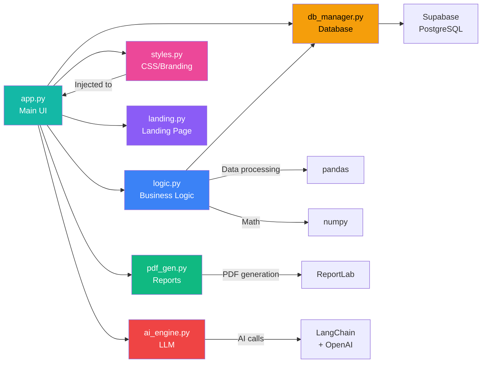
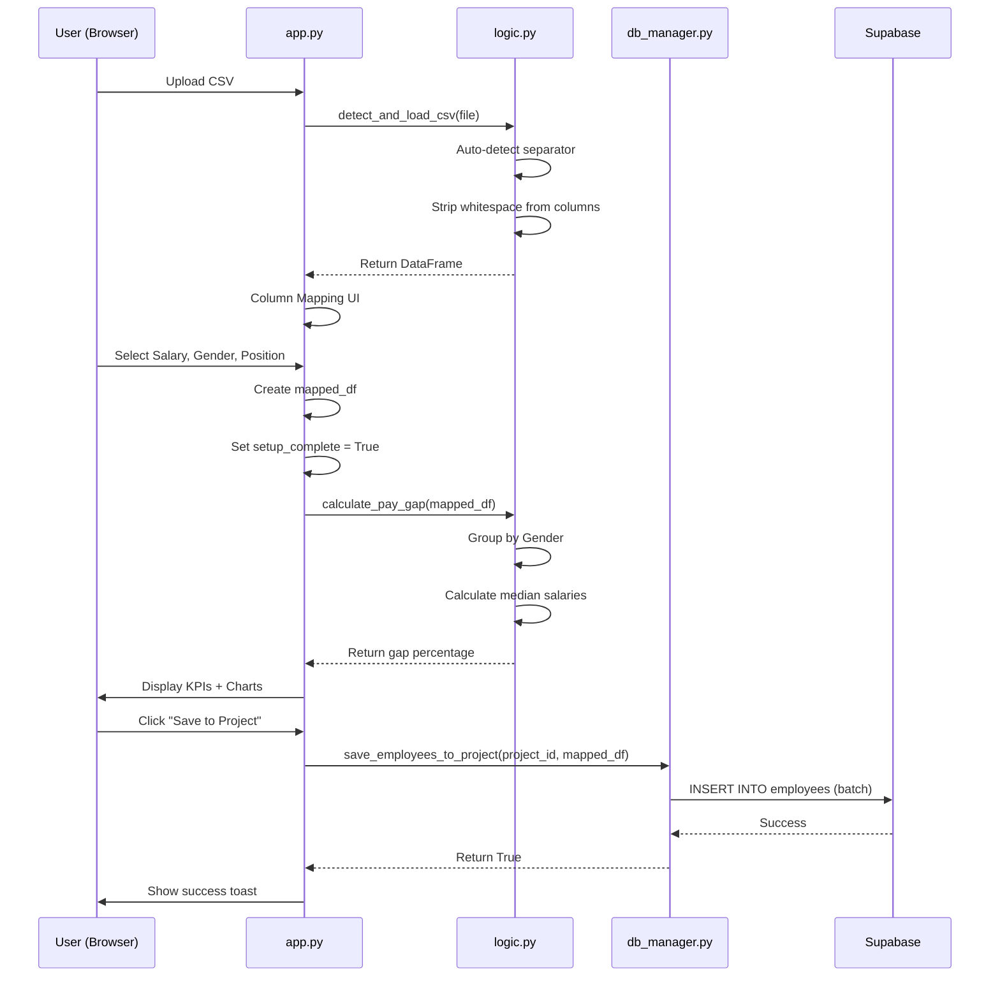
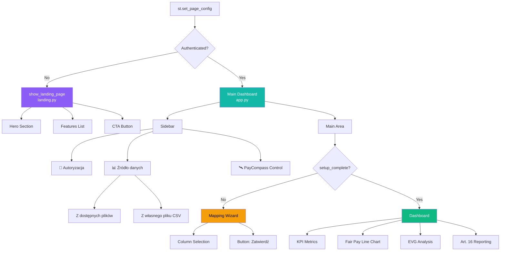
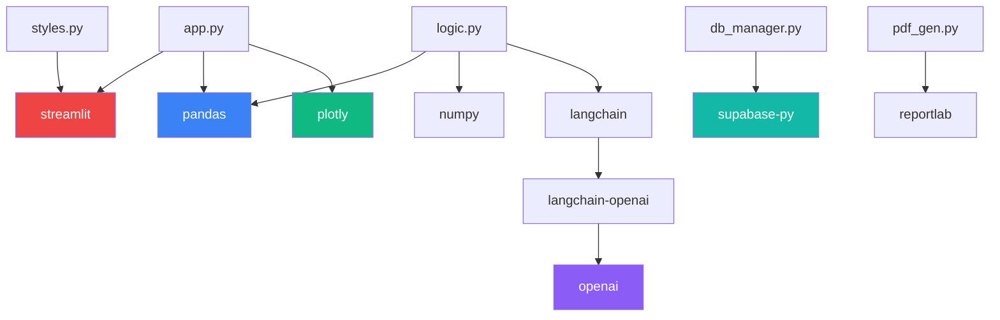

# GraphRAG - Knowledge Graph for PayCompass Pro
## System Relationship Map & Context Engineering

**Purpose:** Enable AI agents to quickly understand codebase structure and dependencies  
**Format:** Mermaid diagrams + relationship tables  
**Last Updated:** 2026-02-03

---

## 1. Document Hierarchy

```mermaid
graph TD
    A[/docs/ Folder] --> B[PRD.md]
    A --> C[TECH_STACK.md]
    A --> D[FRONTEND_GUIDELINES.md]
    A --> E[BACKEND_STRUCTURE.md]
    A --> F[LESSONS.md]
    
    B --> |"Defines features"| G[app.py]
    C --> |"Tech choices"| G
    C --> |"Tech choices"| H[logic.py]
    C --> |"Tech choices"| I[db_manager.py]
    
    D --> |"Styling rules"| J[styles.py]
    D --> |"Component usage"| G
    
    E --> |"Schema"| I
    E --> |"RLS policies"| I
    
    F --> |"Best practices"| G
    F --> |"Best practices"| H
    F --> |"Best practices"| J
    
    style A fill:#14b8a6,color:#fff
    style B fill:#3b82f6,color:#fff
    style C fill:#3b82f6,color:#fff
    style D fill:#3b82f6,color:#fff
    style E fill:#3b82f6,color:#fff
    style F fill:#ef4444,color:#fff
    style G fill:#f59e0b,color:#000
    style H fill:#f59e0b,color:#000
    style I fill:#f59e0b,color:#000
    style J fill:#f59e0b,color:#000
```

---

## 2. Code Module Relationships



---

## 3. Feature → Code Mapping

| Feature | PRD Section | Primary File(s) | Key Functions |
|---------|-------------|-----------------|---------------|
| **CSV Upload** | 2.1 Data Vault | `logic.py` | `detect_and_load_csv()`, `scan_available_csv_files()` |
| **Column Mapping** | 3. Mapping Wizard | `app.py` (lines ~785-950) | Manual selectbox mapping |
| **Pay Gap Calculation** | Core Analytics | `logic.py` | `calculate_pay_gap(df, evg_group)` |
| **Fair Pay Line** | Core Analytics | `app.py` (chart section) | Plotly scatter + regression line |
| **EVG Engine** | 2.3 EVG (Art. 4) | `logic.py` | `create_equal_value_groups()`, `calculate_pay_gap_by_evg_groups()` |
| **AI Job Scoring** | 2.3 EVG (Art. 4) | `logic.py` | `get_ai_job_grading(positions, api_key)` |
| **Quartile Analysis** | 2.2 Art. 16 | `logic.py` | `calculate_pay_quartiles(df)` |
| **Component Gaps** | 2.2 Art. 16 | `logic.py` | `calculate_component_gaps(df)` |
| **B2B Equalizer** | 2.5 B2B Equalizer | `logic.py` | `b2b_to_uop_bulk(df)` |
| **RODO Shield** | 2.1 Data Vault | `logic.py` | `mask_sensitive_data()`, `detect_pii_columns()` |
| **Multi-tenancy** | Backend | `db_manager.py` | `get_user_projects()`, `save_employees_to_project()` |
| **PDF Export** | Reports | `pdf_gen.py` | `generate_art7_report()`, `create_pdf()` |
| **Authentication** | Security | `app.py` + `db_manager.py` | `login_user()`, `logout_user()`, Supabase Auth |
| **Landing Page** | Marketing | `landing.py` | `show_landing_page()` |

---

## 4. Data Flow Architecture



---

## 5. UI Component Tree



---

## 6. Configuration & Environment

| Variable | File | Purpose |
|----------|------|---------|
| `SUPABASE_URL` | `.env` or `st.secrets` | Supabase project URL |
| `SUPABASE_ANON_KEY` | `.env` or `st.secrets` | Public API key (RLS enforced) |
| `OPENAI_API_KEY` | `.env` or `st.secrets` | For AI job scoring (optional) |
| `NO_FILE_SELECTED` | `logic.py` (constant) | Default value for file selectbox |
| `RODO_GROUP_THRESHOLD` | `logic.py` (constant) | Minimum group size (default: 3) |
| `GENDER_COLORS` | `FRONTEND_GUIDELINES.md` | Chart color mapping |

---

## 7. Critical File Sections (Line Ranges)

### app.py (2262 lines)
```
Lines 1-30:    Imports
Lines 64-66:   st.set_page_config (CRITICAL: initial_sidebar_state)
Lines 95-120:  Session state initialization
Lines 122-550: Sidebar (Auth, Data Source, Projects)
Lines 700-745: Router logic (Landing vs Dashboard)
Lines 785-950: Mapping Wizard (Column selection)
Lines 987-1001: AUTO-COMPLETE (skip wizard if columns exist)
Lines 1004-1800: Dashboard (KPIs, Charts, EVG, Art. 16)
```

### logic.py (1590 lines)
```
Lines 1-22:    Constants (encodings, separators, ZUS caps)
Lines 43-90:   generate_mock_data() - Fallback data generator
Lines 120-255: detect_and_load_csv() - CSV parsing with auto-detect
Lines 256-342: load_and_validate() - Main data loading function
Lines 500-600: calculate_pay_gap() - Core analytics
Lines 650-750: EVG functions (create_equal_value_groups, etc.)
Lines 800-900: B2B Equalizer functions
Lines 1100-1200: Art. 16 functions (calculate_pay_quartiles, calculate_component_gaps)
```

### styles.py (851 lines)
```
Lines 1-720:   apply_custom_css() - Main stylesheet
Lines 40-75:   Hide Streamlit branding
Lines 80-150:  Typography (Inter + JetBrains Mono)
Lines 200-350: Color variables
Lines 400-600: Component overrides (inputs, buttons, dataframes)
Lines 721-850: apply_branding() - Additional visibility fixes
```

### db_manager.py (300 lines - estimated)
```
Lines 1-50:    Supabase client initialization
Lines 60-120:  Authentication functions (login_user, logout_user)
Lines 130-200: Project management (get_user_projects, initialize_default_tenant)
Lines 210-300: Employee CRUD (save_employees_to_project, load_employees_from_project)
```

---

## 8. Dependency Graph (Python Packages)



---

## 9. Common Debugging Paths

### Issue: "Black screen / nothing visible"
**Path:** 
1. Check `LESSONS.md` → Lesson #1 (st.stop() placement)
2. Check `FRONTEND_GUIDELINES.md` → Section 10.1 (Black Screen)
3. Inspect router logic in `app.py` lines 700-745

### Issue: "File not found" when loading CSV
**Path:**
1. Check `LESSONS.md` → Lesson #4 (os.path.exists)
2. Check `logic.py` → `load_and_validate()` function (lines 256-342)
3. Add debug expander to show `os.getcwd()` and `os.listdir()`

### Issue: "Pay gap calculation wrong"
**Path:**
1. Check `PRD.md` → Section 2.3 (EVG Engine)
2. Check `logic.py` → `calculate_pay_gap()` function
3. Verify input DataFrame has columns: `Gender`, `Salary`, `Scoring`

### Issue: "Button doesn't work"
**Path:**
1. Check `LESSONS.md` → Lesson #8 (on_click callbacks)
2. Check `FRONTEND_GUIDELINES.md` → Section 10.2 (Form Submit)
3. Ensure `st.rerun()` is called after state change

### Issue: "Text invisible / low contrast"
**Path:**
1. Check `LESSONS.md` → Lesson #2 (explicit color)
2. Check `FRONTEND_GUIDELINES.md` → Section 4.1 (CSS Overrides)
3. Check `styles.py` → `apply_branding()` function

---

## 10. AI Agent Prompts (How to Use This Graph)

### For Code Generation:
```
When generating code for PayCompass:
1. Reference LESSONS.md to avoid known pitfalls
2. Follow FRONTEND_GUIDELINES.md for UI components
3. Match style from TECH_STACK.md (use_container_width, not use_column_width)
4. Check PRD.md to understand feature intent
5. Use BACKEND_STRUCTURE.md for database operations
```

### For Debugging:
```
When debugging issue in PayCompass:
1. Identify symptom
2. Search LESSONS.md for matching symptom
3. Check graphrag.md Section 9 (Common Debugging Paths)
4. Inspect file at line range specified in Section 7
5. Cite lesson number or documentation section in explanation
```

### For Feature Addition:
```
When adding new feature to PayCompass:
1. Check PRD.md to ensure feature aligns with product vision
2. Identify which module (logic.py, app.py, etc.) from Section 3
3. Follow data flow pattern from Section 4
4. Apply styling rules from FRONTEND_GUIDELINES.md
5. Update this graphrag.md with new relationships
```

---

## 11. Knowledge Base Updates

**When to update this file:**
- New feature added (update Section 3)
- New module created (update Section 2)
- Major refactoring (update Section 7 line ranges)
- New common bug pattern (update Section 9)

**How to update:**
1. Edit this file directly
2. Update `Last Updated` date at top
3. Commit with message: `docs: update graphrag.md - [change description]`

---

**Document Owner:** Engineering Team + AI Agents  
**Last Review:** 2026-02-03  
**Next Review:** 2026-02-10
