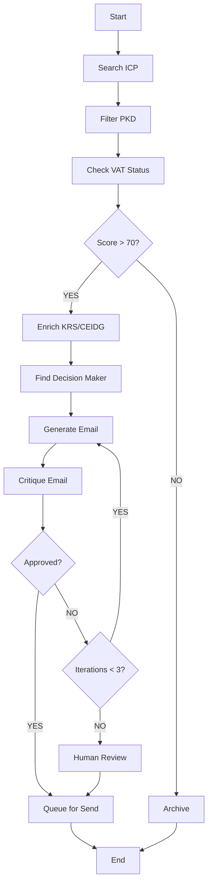
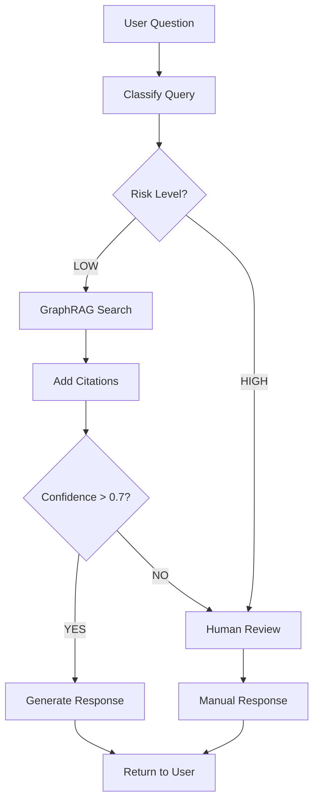
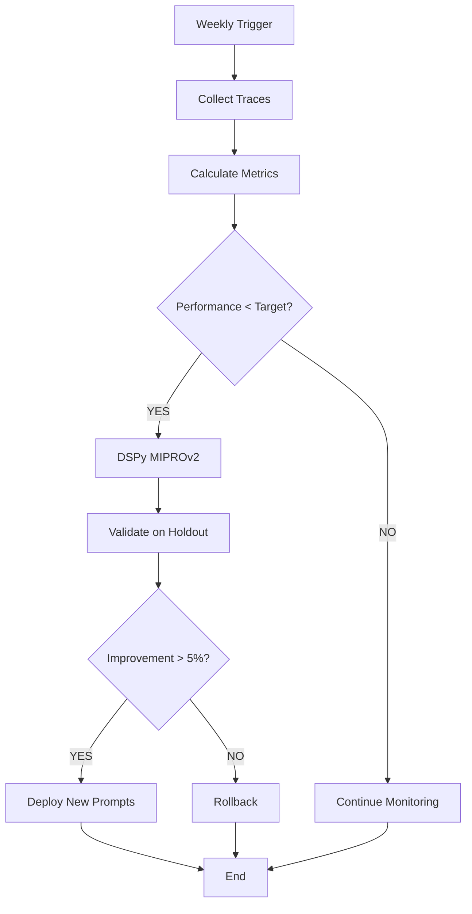

# GapRoll — Agent Blueprints
## LangGraph Architecture for Hunter, Guardian & Analyst

**Last Updated:** 2026-02-14  
**Previous Name:** PayCompass (sunset Feb 14, 2026)  
**Framework:** LangGraph (deterministic orchestration with HITL breakpoints)

---

## 1. Agent System Overview

| Agent | Role | Risk Level | Timeline |
|-------|------|------------|----------|
| **Hunter** | Lead discovery + cold outreach | Medium | Discovery: Mar 29, Outreach: Jun 8 |
| **Guardian** | Legal/HR compliance assistant | HIGH (EU AI Act) | Apr 12 (Alpha), May 17 (Beta) |
| **Analyst** | Self-improvement optimizer | Low | May 10 (Alpha), Jun 8 (Production) |

---

## 2. Hunter Agent — Cold Outreach Automation

### 2.1 Mission

> Discover Polish companies (50-500 employees) + generate personalized cold emails that don't feel like AI spam.

### 2.2 Architecture (LangGraph)



---

### 2.3 LangGraph Implementation

```python
from langgraph.graph import StateGraph, END
from typing import TypedDict, List

class HunterState(TypedDict):
    company_name: str
    pkd_code: str
    vat_number: str
    lead_score: int
    decision_maker: dict
    email_draft: str
    critique: str
    iterations: int
    approved: bool

def search_icp(state: HunterState) -> HunterState:
    """Query KRS/CEIDG for companies matching ICP"""
    # KRS API: target by PKD code (69.20.Z = accounting, 70.22.Z = consulting)
    companies = krs_api.search(pkd_code=["69.20.Z", "70.22.Z"], employees="50-500")
    return {"companies": companies}

def filter_pkd(state: HunterState) -> HunterState:
    """Filter by industry relevance"""
    # Focus: accounting firms, HR consulting, payroll services
    relevant_pkd = ["69.20.Z", "70.22.Z", "82.11.Z"]
    filtered = [c for c in state["companies"] if c["pkd"] in relevant_pkd]
    return {"companies": filtered}

def check_vat(state: HunterState) -> HunterState:
    """Verify VAT registration (active company check)"""
    # Biała Lista Podatników API (Polish VAT registry)
    vat_active = vat_api.verify(state["vat_number"])
    return {"vat_active": vat_active}

def score_lead(state: HunterState) -> HunterState:
    """Calculate lead score (0-100)"""
    score = (
        (state["employees"] / 500) * 30 +  # Size (larger = higher score)
        (state["revenue"] / 10_000_000) * 30 +  # Revenue
        (state["industry_fit"] * 20) +  # Industry relevance
        (state["recency"] * 20)  # Freshly registered = higher intent
    )
    return {"lead_score": score}

def enrich_krs(state: HunterState) -> HunterState:
    """Lazy load: Only enrich if score > 70 (saves API costs)"""
    if state["lead_score"] < 70:
        return state
    
    # KRS API (paid, ~1 PLN/query)
    data = krs_api.get_details(state["company_name"])
    return {
        "size": data["employees"],
        "revenue": data["revenue"],
        "nip": data["nip"],
        "legal_form": data["legal_form"],
    }

def find_decision_maker(state: HunterState) -> HunterState:
    """LinkedIn scraper: Find CEO, CFO, or HR Manager"""
    # Option 1: Cognism API (RODO-compliant)
    # Option 2: LinkedIn Sales Navigator scraper (risky)
    decision_maker = cognism_api.find_contact(
        company=state["company_name"],
        titles=["CEO", "CFO", "HR Manager", "Dyrektor HR"],
    )
    return {"decision_maker": decision_maker}

def generate_email(state: HunterState) -> HunterState:
    """Generate personalized email (GPT-4o)"""
    prompt = f"""
    Napisz polską wiadomość cold outreach dla:
    - Firma: {state['company_name']}
    - Kontakt: {state['decision_maker']['name']} ({state['decision_maker']['title']})
    - Branża: {state['industry']}
    
    ZASADY:
    - Formal tone ("Szanowna Pani" / "Szanowny Panie")
    - Max 120 słów
    - Personalizacja: Wspomnij szczegół o firmie (LinkedIn post, news, job listing)
    - Value prop: "Pełna zgodność z Dyrektywą UE 2023/970 za 99 PLN/mies"
    - CTA: Umów 15-min demo
    - NO spam words: "niesamowity", "rewolucyjny", "exclusive offer"
    """
    
    draft = llm.invoke(prompt)
    return {"email_draft": draft, "iterations": state["iterations"] + 1}

def critique_email(state: HunterState) -> HunterState:
    """Critic LLM: Check for spam triggers"""
    prompt = f"""
    Oceń email pod kątem spam triggers:
    
    {state['email_draft']}
    
    Sprawdź:
    - Czy ma słowa spam? (niesamowity, rewolucyjny, guarantee)
    - Czy jest zbyt długi? (max 120 słów)
    - Czy personalizacja jest prawdziwa? (nie generic)
    - Czy CTA jest jasny?
    
    Odpowiedź: "APPROVED" lub "NEEDS_REVISION: [reason]"
    """
    
    critique = llm.invoke(prompt)
    approved = "APPROVED" in critique
    return {"critique": critique, "approved": approved}

def should_continue(state: HunterState) -> str:
    """Router: Continue loop or end?"""
    if state["approved"]:
        return "queue"
    elif state["iterations"] >= 3:
        return "hitl"  # Max iterations reached, human review
    else:
        return "generator"  # Try again

# Build graph
workflow = StateGraph(HunterState)
workflow.add_node("search", search_icp)
workflow.add_node("filter", filter_pkd)
workflow.add_node("vat_check", check_vat)
workflow.add_node("score", score_lead)
workflow.add_node("enrich", enrich_krs)
workflow.add_node("find_dm", find_decision_maker)
workflow.add_node("generator", generate_email)
workflow.add_node("critic", critique_email)

workflow.add_edge("search", "filter")
workflow.add_edge("filter", "vat_check")
workflow.add_edge("vat_check", "score")
workflow.add_conditional_edges("score", lambda s: "enrich" if s["lead_score"] > 70 else "archive")
workflow.add_edge("enrich", "find_dm")
workflow.add_edge("find_dm", "generator")
workflow.add_edge("generator", "critic")
workflow.add_conditional_edges("critic", should_continue)

workflow.set_entry_point("search")

# Compile with checkpointing (HITL support)
app = workflow.compile(checkpointer=SqliteSaver.from_conn_string("hunter.db"), interrupt_before=["queue"])
```

---

### 2.4 Timeline & Volume Constraints

| Period | Daily Limit | Action | Domain Rep |
|--------|-------------|--------|-----------|
| **Feb 22 - Mar 29** | 0/day | Discovery ONLY (build lead database) | Warming (20/day warm contacts) |
| **Apr 1 - Apr 30** | 20/day | Manual outreach (Bartek approves each email) | 95%+ inbox |
| **May 1 - Jun 7** | 50/day | Semi-automated (Bartek reviews queue, batch approves) | 95%+ inbox |
| **Jun 8+** | 100/day | Fully automated (HITL for edge cases only) | 95%+ inbox |

**Hard Limit:** NEVER exceed 200 emails/day (spam trigger threshold)

---

### 2.5 Email Template (Formal Polish)

```
Temat: Zgodność z Dyrektywą UE 2023/970 — 15 min rozmowa?

Szanowna Pani [Name],

Zauważyłem, że [Company] niedawno [specific detail from LinkedIn/news].

W związku z terminem 7 czerwca 2026 (Dyrektywa UE 2023/970), 
przygotowaliśmy rozwiązanie GapRoll, które automatyzuje raporty Art. 16 w 15 minut.

Czy byłaby Pani zainteresowana 15-minutową rozmową, aby zobaczyć jak to działa?

[Umów demo - Calendly link]

Pozdrawiam,
[Signature]
```

**Key Elements:**
- ✅ Formal greeting ("Szanowna Pani")
- ✅ Personalization (specific detail about company)
- ✅ Urgency (deadline: Jun 7, 2026)
- ✅ Value prop (15 minutes to compliance)
- ✅ Clear CTA (Calendly link)

---

## 3. Guardian Agent — Legal Compliance Assistant

### 3.1 Mission

> Answer Grażyna's legal/HR questions with citations to Art. X of EU Directive 2023/970, Kodeks Pracy, RODO, etc.

### 3.2 Architecture (LangGraph + GraphRAG)



---

### 3.3 Risk Classification

| Query Type | Risk Level | Action |
|-----------|------------|--------|
| **Factual (Art. X definition)** | LOW | RAG → Auto-respond |
| **Interpretation (Is gap 12% legal?)** | MEDIUM | RAG + confidence check |
| **Advisory (Should I fire employee X?)** | HIGH | ALWAYS HITL |

**HIGH-RISK Keywords (auto-trigger HITL):**
- "Zwolnienie dyscyplinarne" (disciplinary termination)
- "Wypowiedzenie" (termination)
- "Pozew" (lawsuit)
- "Dyskryminacja" (discrimination)
- "Mobbing" (mobbing)

---

### 3.4 GraphRAG Implementation

**Why GraphRAG (not vector RAG):**
- ✅ Captures relationships: "Art. 16 requires Art. 4" (cross-references)
- ✅ Better for legal docs (hierarchical structure: Directive → Article → Paragraph)
- ❌ Vector RAG: Matches keywords, misses logical connections

**Tech Stack:**
- **Vector DB:** Weaviate (self-hosted on Hetzner VPS)
- **Graph Edges:** Article X → Article Y (requires, references, complements)
- **Embeddings:** text-embedding-3-small (OpenAI, 1536 dims)

**Ingestion Pipeline:**

```python
import weaviate
from langchain.text_splitter import RecursiveCharacterTextSplitter

# Split legal docs into chunks (500 chars, 50 overlap)
splitter = RecursiveCharacterTextSplitter(chunk_size=500, chunk_overlap=50)
chunks = splitter.split_documents([directive_pdf, kodeks_pracy_pdf])

# Create graph edges (manual annotation)
edges = [
    ("Art. 16", "Art. 4", "requires"),  # Art. 16 requires EVG from Art. 4
    ("Art. 7", "Art. 4", "depends_on"),  # Worker reports depend on EVG
    ("Art. 9", "Art. 16", "triggered_by"),  # Joint assessment triggered by gap >5%
]

# Ingest to Weaviate
client = weaviate.Client("http://localhost:8080")
for chunk in chunks:
    client.data_object.create(
        class_name="LegalChunk",
        data_object={
            "text": chunk.page_content,
            "source": chunk.metadata["source"],
            "article": chunk.metadata["article"],
        },
        vector=embed(chunk.page_content),  # OpenAI embedding
    )

# Add edges
for source, target, relation in edges:
    client.data_object.reference.add(
        from_uuid=get_uuid(source),
        to_uuid=get_uuid(target),
        from_property_name=relation,
    )
```

---

### 3.5 Guardian Response Format

**Example Query:**
```
"Czy luka 12% to naruszenie prawa?"
```

**Guardian Response:**
```
Nie automatycznie. Art. 16 Dyrektywy UE 2023/970 nie definiuje "niedopuszczalnego" poziomu luki.

Jednak:
- Jeśli luka >5% → Art. 9 wymaga wyjaśnienia przyczyn (Joint Pay Assessment)
- Jeśli luka >25% → PIP może wszcząć kontrolę (precedens orzecznictwa)

Twoja luka (12%) → wymaga monitorowania i planu działania.

Rekomendacja: Przygotuj Raport Art. 7 (uzasadnienie).

[Link do szablonu Art. 7]

Podstawa prawna:
- Art. 9 Dyrektywy UE 2023/970 (Joint Pay Assessment)
- Art. 16 Dyrektywy UE 2023/970 (Reporting)
```

**Key Elements:**
- ✅ Direct answer ("Nie automatycznie")
- ✅ Legal citations ("Art. 9 wymaga...")
- ✅ Practical guidance ("Przygotuj Raport Art. 7")
- ✅ Polish formal tone

---

## 4. Analyst Agent — Self-Improvement Optimizer

### 4.1 Mission

> Monitor Hunter & Guardian performance → optimize prompts via DSPy MIPROv2 → improve agent quality over time.

### 4.2 Architecture (DSPy + LangSmith)



---

### 4.3 Metrics Tracked

**Hunter Agent:**
| Metric | Target | Current | Source |
|--------|--------|---------|--------|
| Email open rate | >20% | 18% | Mailchimp |
| Response rate | >10% | 8% | Mailchimp |
| Spam complaint rate | <0.5% | 0.3% | Mailchimp |
| Bounce rate | <2% | 1.5% | Mailchimp |

**Guardian Agent:**
| Metric | Target | Current | Source |
|--------|--------|---------|--------|
| Answer accuracy | >90% | 87% | Human eval (Golden Dataset) |
| Citation correctness | 100% | 95% | Automated check |
| HITL rejection rate | <20% | 25% | LangSmith |
| Response time | <5s | 4.2s | LangSmith |

---

### 4.4 DSPy MIPROv2 Optimization

**What is MIPROv2:**
- Multi-Instruction Prompt Optimization (v2)
- Uses teacher model (GPT-4o) to generate training examples
- Uses student model (GPT-4o-mini) for production (60% cheaper)
- Automatically optimizes prompts based on Golden Dataset

**Process:**

```python
import dspy
from dspy.teleprompt import MIPROv2

# Define signature
class GuardianQA(dspy.Signature):
    """Answer legal question with citations"""
    question = dspy.InputField(desc="User's legal question")
    answer = dspy.OutputField(desc="Answer with citations to Art. X")

# Create module
class Guardian(dspy.Module):
    def __init__(self):
        super().__init__()
        self.qa = dspy.ChainOfThought(GuardianQA)
    
    def forward(self, question):
        return self.qa(question=question)

# Golden Dataset (50 examples minimum)
trainset = [
    dspy.Example(
        question="Czy luka 12% to naruszenie?",
        answer="Nie automatycznie. Art. 9 wymaga wyjaśnienia jeśli >5%...",
    ).with_inputs("question"),
    # ... 49 more examples
]

# Optimize with MIPROv2
teleprompter = MIPROv2(
    metric=answer_quality_metric,  # Custom metric (citation correctness + accuracy)
    teacher_model=dspy.OpenAI(model="gpt-4o"),
    student_model=dspy.OpenAI(model="gpt-4o-mini"),
    num_candidates=10,  # Generate 10 prompt variations
    max_iterations=5,   # Test up to 5 iterations
)

optimized_guardian = teleprompter.compile(Guardian(), trainset=trainset)
```

**Deployment:**
- Weekly optimization (every Monday 9 AM)
- Validate on holdout set (20% of Golden Dataset)
- Deploy only if improvement >5%
- Rollback if accuracy drops

---

## 5. HITL (Human-in-the-Loop) Workflow

### 5.1 HITL Queue (Next.js Admin Panel)

**URL:** `/admin/hitl-queue`

**Columns:**
| Column | Content |
|--------|---------|
| **Agent** | Hunter, Guardian, Analyst |
| **Type** | Email draft, Legal Q&A, Prompt change |
| **Created** | Timestamp |
| **Priority** | HIGH (compliance), MEDIUM (outreach), LOW (optimization) |
| **Status** | Pending, Approved, Rejected |
| **Actions** | [Approve] [Reject] [Edit & Approve] |

**Example:**
```
Agent: Guardian
Type: Legal Q&A
Question: "Czy mogę zwolnić pracownika za opóźnienia?"
AI Answer: "Tak, po upomnieniu pisemnym (Art. 52 Kodeks Pracy)."
Confidence: 0.65 (below 0.7 threshold → HITL)
Status: Pending
[Approve] [Reject] [Edit & Approve]
```

**Bartek's Action:**
- Approve → AI answer sent to user
- Reject → Manual response required
- Edit & Approve → Modify AI answer, send to user, add to Golden Dataset

---

### 5.2 HITL Approval Metrics

| Metric | Target | Current (Week 1) | Notes |
|--------|--------|------------------|-------|
| **Approval Rate** | >80% | 75% | Improving as Golden Dataset grows |
| **Rejection Rate** | <20% | 25% | Decreasing over time |
| **Edit Rate** | <10% | 15% | Minor tweaks (tone, citations) |

---

## 6. Cost Tracking (LangSmith)

**Monthly Budget:** $200 (at 1000 users, 100k API calls/month)

**Breakdown:**
| Agent | Tokens/Call | Cost/Call | Calls/Month | Total/Month |
|-------|------------|-----------|-------------|-------------|
| **Hunter** | 500 (generation) + 300 (critic) = 800 | $0.0008 | 3,000 (100/day) | $2.40 |
| **Guardian** | 1,000 (RAG + generation) | $0.001 | 10,000 | $10 |
| **Analyst** | 5,000 (DSPy optimization) | $0.005 | 4 (weekly) | $0.02 |
| **Total** | | | | **~$12.42** |

**Note:** At scale (10k users), cost ~$120/month (still <1% of revenue)

---

**END OF 06_AGENT_BLUEPRINTS.md**

**Next Review:** After Hunter Discovery phase (Mar 29, 2026)

**Key Updates This Version (Feb 14, 2026):**
- ✅ Rebrand PayCompass → GapRoll
- ✅ Hunter timeline updated (Discovery: Mar 29, Outreach: Jun 8)
- ✅ Email volume constraints (20→50→100/day progression)
- ✅ GraphRAG architecture for Guardian (Weaviate)
- ✅ DSPy MIPROv2 optimization for Analyst
- ✅ HITL queue design (Next.js admin panel)
- ✅ Cost tracking (LangSmith, $12.42/month baseline)
